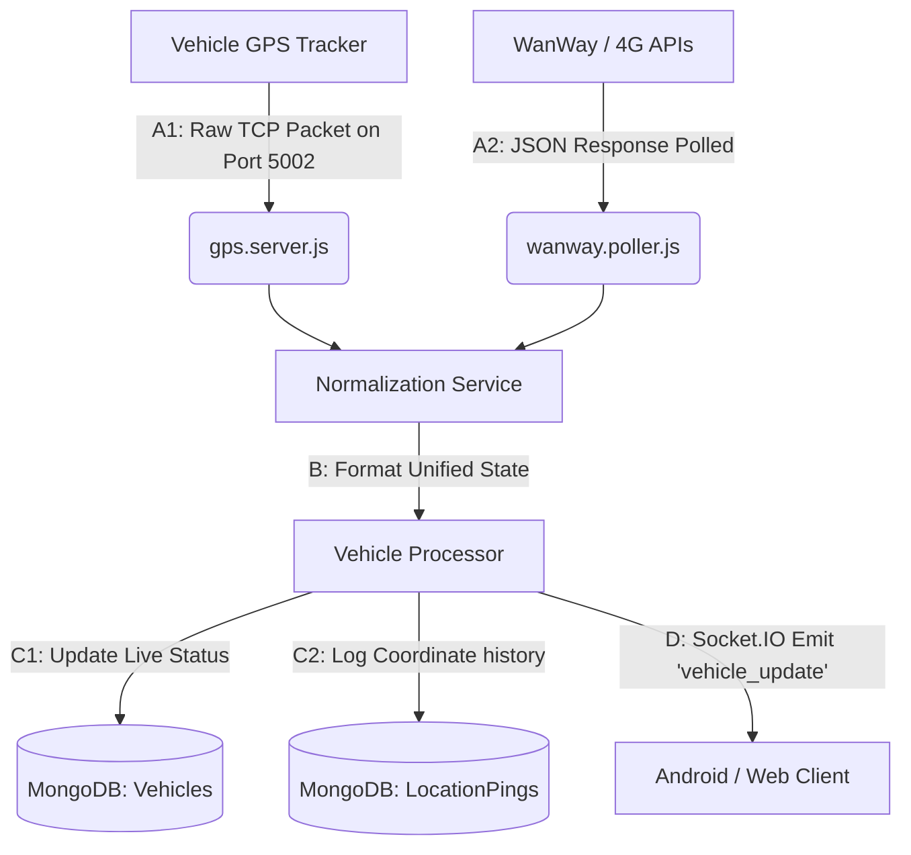

# NVIQ Backend: Architecture & Codebase Guide

This guide is designed to help you understand the architecture, data flows, and code patterns used in the NVIQ fleet tracking system. It starts with the big picture and zooms in to advanced details.

---

## 1. The Big Picture

NVIQ is a **Fleet Telematics and Management System**. Its primary responsibilities are:
1. **Ingesting GPS Data**: Receiving real-time location logs from vehicles (either directly from GT06 tracker hardware over TCP, or by polling third-party APIs like WanWay or 4G API).
2. **Processing & Normalization**: Standardizing raw GPS coordinates, speed, and ignition signals into a single unified format.
3. **Database Storage**: Saving raw location pings, updating vehicle statuses, and tracking daily logs in MongoDB.
4. **Real-time Distribution**: Pushing live vehicle positions to frontend dashboards immediately via WebSockets (Socket.IO).
5. **REST API**: Serving HTTP endpoints for user authentication, onboarding, vehicle configuration, alerts, and analytics.

---

## 2. Directory Structure

Here are the key directories and their purposes:

```
├── server.js               # Entry point: initializes DB, sockets, routes, and background jobs
├── .env                    # Secrets and environment configurations
├── models/                 # Database Schemas (Mongoose / MongoDB models)
│   ├── User.js             # User profiles, plans, and onboarding state
│   ├── Vehicle.js          # Current status, geofence, and tracker info for each vehicle
│   └── LocationPing.js     # History log of all GPS coordinates received
├── routes/                 # Express REST API routes
│   ├── auth.routes.js      # Sign-in, sign-up, session validation, and OTP
│   ├── onboarding.routes.js# Multi-step user profile setup
│   └── vehicles.routes.js  # CRUD operations for managing fleet vehicles
├── services/               # Core business logic and background services
│   ├── gps.server.js       # TCP server listening for raw GT06 hardware GPS pings
│   ├── wanway.poller.js    # Poller retrieving GPS data from WanWay IOP APIs
│   └── diagnostic.js       # Health and system debugging utility
├── middleware/             # HTTP request processors
│   └── auth.js             # Protects routes, parses JWT/Firebase tokens, and caches users
└── utils/                  # Reusable utility scripts
    └── logger.js           # Logger configured with rotation for stdout and files
```

---

## 3. The Lifecycle of a GPS Ping (How Live Tracking Works)

To understand how data flows in this codebase, let's trace a vehicle's coordinate update from the road to the dashboard:



### Step A: Data Ingestion (Two Channels)
1. **Hardware TCP Channel (`services/gps.server.js`)**:
   GPS trackers on vehicles open a raw TCP socket connection to port `5002` on this server. The server parses the raw binary data (mostly GT06 protocol packets) into coordinates, speed, and status.
2. **API Poller Channel (`services/wanway.poller.js`)**:
   Every 30 seconds, a background interval fetches the latest locations of all configured vehicles from third-party vendor servers (like WanWay) via HTTP REST APIs.

### Step B: Normalization
Ingested data from different sources is passed to a processor. The processor normalizes it to a standard structure:
```json
{
  "imei": "356218606576971",
  "latitude": 27.386742,
  "longitude": 76.662009,
  "speed": 0,
  "ignition": false,
  "timestamp": "2026-05-23T17:50:00Z"
}
```

### Step C: Processing & Storage
The normalized ping does two things in the database:
1. **History Log**: Inserts a new document in `LocationPing` to store the historical path of the vehicle.
2. **Current State**: Finds the vehicle in `Vehicle` collection and updates its `lastLatitude`, `lastLongitude`, `speed`, and `ignitionStatus` fields.

### Step D: Live WebSocket Broadcast
Once updated, the backend fires a Socket.IO event:
`global.io.to(fleetId).emit('vehicle_update', vehicleData);`
Connected Android and Web clients listen for this event and update the vehicle's position on the map in real-time without reloading the screen.

---

## 4. Deep Dive into Key Concepts

### A. Authentication & Cache Middleware (`middleware/auth.js`)
To avoid querying MongoDB on *every single API request*, the authentication middleware uses an **in-memory Cache** (`Map`):
1. A request comes in with `Authorization: Bearer <token>`.
2. The server verifies and decodes the JWT using `process.env.JWT_SECRET`.
3. It checks the in-memory `userCache` map using the user ID.
4. If found, it skips the DB query. If not, it fetches from MongoDB, caches it for 5 minutes (`CACHE_TTL`), and proceeds.
5. If the user updates their profile, `clearUserCache(userId)` is called to ensure stale data is invalidated.

### B. Dynamic Onboarding Mappings (`routes/onboarding.routes.js`)
In Step 1 and Step 2 of onboarding, the code handles key misspelling tolerances dynamically:
- **Step 1**: It maps the company name by searching `companyName || company || req.body['company name'] || req.body['compoany name']`.
- **Step 2**: It maps fleet parameters using `fleetSize || fleetSzie` and `vehicleTypes || vechileTypes`.
- When Step 2 finishes, it sets `onboardingComplete = true`. The client reads this state to redirect the user from setup views directly to the dashboard.

---

## 5. Guide to Writing Code (Conventions & Patterns)

When adding new features, follow these patterns to maintain clean architecture:

### 1. Modifying a Schema (Database Model)
- Define new fields in the corresponding file in `models/`.
- If a field must be unique but can be empty/optional, use:
  `{ type: String, unique: true, sparse: true }`
  *(Otherwise, MongoDB will throw duplicate key errors on `null` values!)*

### 2. Adding a Route
- Put API endpoint groups in `routes/`.
- Always wrap routes that require log-in with the `protect` middleware:
  `router.post('/my-secure-endpoint', protect, async (req, res) => { ... })`
- Place public routes (like login/OTP) outside `protect`.

### 3. Error Handling
- Always use `try/catch` in your routes and async methods.
- Log errors on the server side using `console.error` or `logger.error` so you can debug them, while returning a clean, friendly JSON response to the client:
  ```javascript
  } catch (error) {
    console.error("Critical description:", error);
    return res.status(500).json({ success: false, message: "Something went wrong" });
  }
  ```
